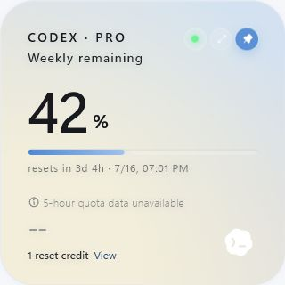

<p align="center">
  
</p>

<h1 align="center">Quota Float — Coding Assistant Quota Monitor</h1>

<p align="center">
  A lightweight, local-first desktop widget that keeps Codex, Qoder, TRAE, WorkBuddy, Volcengine Ark Coding Plan, and Google Antigravity usage limits visible at a glance.
</p>

<p align="center">
  <a href="https://github.com/silverlion2/quota-float/releases/latest"></a>
  <a href="https://github.com/silverlion2/quota-float/releases"></a>
  <a href="https://github.com/silverlion2/quota-float/actions/workflows/ci.yml"></a>
  <a href="LICENSE"></a>
  
</p>

<p align="center">
  <strong><a href="https://github.com/silverlion2/quota-float/releases/latest">Download for Windows or macOS</a></strong>
  · <a href="README.zh-CN.md">简体中文</a>
  · <a href="https://github.com/silverlion2/quota-float/issues">Report an issue</a>
</p>


Quota Float is an always-on-top **Codex quota monitor and coding-assistant usage dashboard** for Windows and macOS. It reads the sign-in state already stored by supported local apps and CLIs, then displays real quota windows, remaining balances, reset times, and daily usage pace without asking you to paste credentials.

## Why Quota Float?

- **All quotas in one place:** monitor Codex, Qoder, TRAE, WorkBuddy, Volcengine Ark Coding Plan, and Google Antigravity from one compact widget.
- **Useful before a limit hits:** see healthy, caution, and critical states, quota pace guidance, reset timing, and configurable desktop alerts.
- **Stays out of the way:** collapse to a floating orb, expand on hover, reorder providers, and choose compact, standard, or detailed layouts.
- **Resilient by design:** transient failures are retried, while last-known-good values remain visible and clearly marked as stale.
- **Private by default:** no telemetry, analytics, account modification, prompt collection, or third-party tracking.
- **Desktop-native:** built with Tauri, Rust, React, and TypeScript, with signed in-app update artifacts and Stable/Beta channels.

## Supported Providers

| Provider | Quota source | Requirement |
| --- | --- | --- |
| OpenAI Codex | Existing Codex local sign-in state | Codex Desktop or Codex CLI signed in |
| Qoder | Local account cache | Qoder installed and signed in |
| TRAE | Existing TRAE local sign-in state | TRAE installed and signed in |
| WorkBuddy | Existing WorkBuddy local sign-in state | WorkBuddy installed and signed in |
| Volcengine Ark Coding Plan | Authenticated `arkcli usage plan` output | Ark CLI installed and signed in |
| Google Antigravity | Local CSRF-protected language-server quota status | Antigravity installed, open, and signed in |

Quota Float uses these sources in read-only mode. If a provider changes its response format or a session expires, the app reports an unavailable or stale state instead of inventing a value.

## Download and Install

Get the newest build from **[GitHub Releases](https://github.com/silverlion2/quota-float/releases/latest)**.

- **Windows:** download the per-user `x64-setup.exe` installer. Administrator access is not required.
- **macOS:** download the Universal `.dmg`, compatible with Apple silicon and Intel Macs.

Updater artifacts are signed with the project's Tauri update key. Windows Authenticode signing and macOS notarization require separate certificates, so unsigned builds may still trigger SmartScreen or Gatekeeper warnings.

## Features

- Real quota windows, exact remaining balances, unlimited-plan states, and reset-credit expiration times when available.
- Daily quota pace guidance and alerts, configurable thresholds, quiet hours, and notification cooldowns.
- Floating orb, persistent expansion, always-on-top control, provider rotation, drag-to-reorder, and localized tray actions.
- Local quota timeline for resets, low-quota crossings, provider failures, recoveries, and updates.
- Custom accent colors, hidden or condensed providers, reusable layout profiles, and system-login autostart.
- Independent Float/Ring/Bar compact layouts and Dashboard/Provider-bar/Stacked expanded layouts, with Aurora, Graphite, or Paper colors shared across every layout plus System/Light/Dark appearance.
- Rotating recovery points before updates plus one-file export/import for settings, layouts, and history.
- Redacted diagnostic reports that exclude tokens, account IDs, local auth paths, and raw provider responses.
- A Provider Health Center showing each local source, freshness, recovery state, and bounded history count.
- Automatic updates with Stable/Beta discovery and a convenient restart flow.

## Screenshots

| Floating orb | Reset credit expiration | Weekly quota fallback |
| --- | --- | --- |
|  |  |  |

## Privacy and Security

Quota Float sends each provider's existing token only to that provider's official quota service; Volcengine access stays inside Ark CLI, and Antigravity is queried through its loopback-only local quota service. The app stores only its own preferences, bounded quota samples, event summaries, layout profiles, and recovery points.

It does **not** store provider tokens, account IDs, prompts, chat history, raw quota responses, or local auth paths. It does not redeem reset credits or change provider account settings. See [Privacy](PRIVACY.md) and [Security](SECURITY.md) for the complete boundary.

## FAQ

### How do I check my Codex quota?

Install Quota Float on the same computer where Codex Desktop or Codex CLI is already signed in. The widget reads that existing local session and shows the available Codex usage windows and reset times.

### Does Quota Float calculate usage from local token counts?

No. It displays provider-reported quota data or a supported local account cache. It does not estimate quota from prompts or local token counts.

### Do I need to enter an API key or copy a token?

No. Quota Float reuses supported local sign-in states in read-only mode. Never paste a token into an issue or diagnostic report.

### Can I monitor several coding assistants at once?

Yes. Every detected provider appears in the same widget, and you can reorder, hide, condense, or rotate providers.

### Does the browser preview show my real quota?

No. `npm run dev` uses mock data. Real quota reading requires the Tauri desktop app and an existing supported local login.

## Development

Requirements: Node.js 20+, Rust stable, and the [Tauri 2 system dependencies](https://v2.tauri.app/start/prerequisites/) for your platform.

```bash
npm install
npm run test
npm run build
npm run tauri dev
```

Build a desktop bundle with:

```bash
npm run tauri build
```

After a Codex Desktop update, run `npm run check:codex`. See the [Codex update compatibility guide](docs/CODEX-UPDATE-CHECK.md) and [release checklist](docs/GITHUB-RELEASE-CHECKLIST.md) for maintainer workflows.

## Contributing

Bug reports, compatibility reports, feature requests, and pull requests are welcome. Read [CONTRIBUTING.md](CONTRIBUTING.md) first, and remove personal data from screenshots and logs before posting.

## License

Quota Float is available under the [MIT License](LICENSE).
