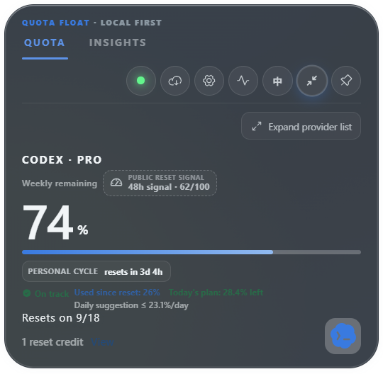
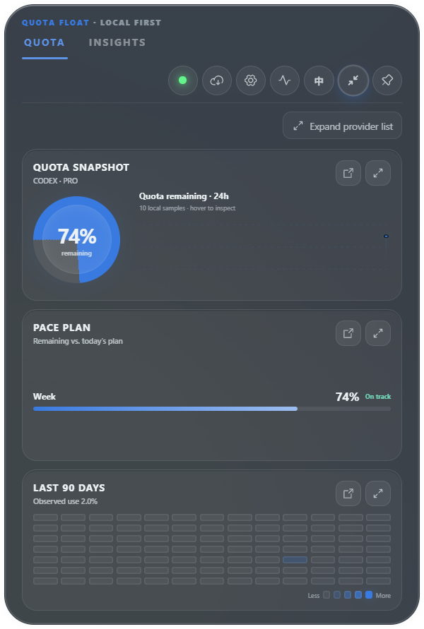

# 自适应悬浮窗更新计划与交付记录

## 目标与范围

只有 Codex 等一个可见平台时，自动收起重复的平台列表，真正缩小原生窗口；多个平台时可主动收起列表，并通过紧凑导航继续切换。设置、诊断、更新和洞察临时使用完整宽度，关闭后恢复。此次用户已授权整合、提交、push、发布和最终归档。

原始问题有三层：QuotaCard 从完整平台目录生成行，未检测平台也占位置；展开列表始终渲染；App 只观察高度，Rust 原生展开宽度固定。仅隐藏 CSS 栏目不足以释放桌面空间。

## GitHub 源码研究

2026-09-14 在线检索并阅读以下固定提交的源码，借鉴行为与边界，不复制实现、不新增依赖。

| 项目与源码 | 已确认做法 | 本次采用 |
| --- | --- | --- |
| [CodexBar 平台切换](https://github.com/steipete/CodexBar/blob/a5f2c581ce2e859dab983e28af50c03351db7dd3/Sources/CodexBar/StatusItemController%2BMenu.swift#L520) | 仅多个平台时添加切换导航 | 单平台去掉重复导航；控制中心保留完整目录 |
| [CodexBar 菜单宽度](https://github.com/steipete/CodexBar/blob/a5f2c581ce2e859dab983e28af50c03351db7dd3/Sources/CodexBar/StatusItemController%2BMenuWidthCache.swift#L7) | 单平台按当前内容、多平台按最大需要宽度并缓存 | 使用稳定尺寸档位，额度数字和刷新变化不触发宽度抖动 |
| [react-resizable-panels 尺寸限制](https://github.com/bvaughn/react-resizable-panels/blob/152b1a8f856438c432b360a77a5afbdeb78782fb/lib/global/utils/validatePanelSize.ts)及[展开恢复](https://github.com/bvaughn/react-resizable-panels/blob/152b1a8f856438c432b360a77a5afbdeb78782fb/lib/global/utils/getImperativePanelMethods.ts) | 区分 collapsed/min/max 与恢复尺寸，处理单面板 | 自动状态和用户主动折叠分开；使用可访问按钮恢复完整视图 |
| [Tauri window-state](https://github.com/tauri-apps/plugins-workspace/blob/0850317b5c85092cbf4ea9caf4ef3a9c771fcf27/plugins/window-state/src/lib.rs#L189) | 位置先验证显示器交集，位置和物理尺寸分别恢复 | 复用现有 Rust 工作区、DPI 与磁吸几何，不叠加通用窗口持久化插件 |

CodexBar 属于 Swift/AppKit；react-resizable-panels 不能缩小 Tauri 外窗；window-state 与现有边缘锚点逻辑重叠。此次直接使用现有 React、CSS Grid 和 Rust。拖动分栏与跨重启保存手动折叠偏好留作独立增强，不引入新的设置迁移。

## 完整实施顺序

1. 以可见快照及用户隐藏配置确定实际平台列表。保留 loading、stale、signed-out、unavailable 平台和最后成功数据，不以健康状态过滤。暂停平台仍能查看已有数据。
2. 单平台默认折叠，多个平台默认展开；用户可以主动展开或收起。会话状态放在 App，鼠标移出收回浮窗、再次展开时保持用户选择。折叠内容不参与焦点导航，多平台仍保留一个紧凑切换入口。
3. Dashboard、Provider Bar、Stacked 折叠时目标原生总宽 360 逻辑像素；Cockpit 折叠时 400；完整列表、弹层与 Insights 为 552。CSS 卡片扣除左右各 4 像素透明安全边距，Cockpit 窄态改为单列。
4. QuotaCard 提供明确的目标宽度属性。App 使用 ResizeObserver 读实测高度、MutationObserver 读宽度策略变化，requestAnimationFrame 合并并去重。采用目标宽度而非受当前窗口限制的 offsetWidth，确保窄窗可以重新展开。
5. bridge 增加可选宽度参数。Rust 验证有限值、限制 360…552 并按当前工作区约束；省略宽度维持旧调用行为和现有尺寸。高度继续包含安全边距。
6. 复用 Top/Left/Right 锚点、归一化 offset、负坐标与 DPI 转换。固定展开状态切换紧凑布局时重新同步宽高；鼠标回到展开窗不重置几何。
7. 联合验证组件、桥接、应用生命周期与原生几何。使用隔离的合成 E2E 桌面应用验证四布局窄窗、实际 viewport、设置展开/恢复并保存截图。
8. 执行桌面 fast gate、版本与 bundle 检查，提交并推送 main；运行项目在线发布助手，经验证、Windows/macOS 打包、Defender、候选升级烟测和签名附件清单检查后公开 release。核验本地 main、远端和 release tag 一致后归档任务。

## 验收与边界

- 单平台、多个平台、全部隐藏归一化、暂停、失败与恢复；中英文及错误文案不裁切。
- 四种展开布局；列表展开/折叠；设置、洞察、诊断、更新开关；hover 与固定展开。
- 100%、125%、150% DPI，三边 offset 0/0.5/1，负坐标工作区，宽高限制与往返锚点。
- 凭据和真实 provider 读取仍只在 src-tauri；不新增请求、日志、遥测、账号操作或外部数据传输。
- 自动几何与 Windows 合成原生测试不代表真实多屏、所有缩放及 macOS 视觉验收。现有系统签名/公证限制须在发布记录如实标明。

## 回退

此次无持久化格式变更，旧设置、布局方案、历史和备份继续有效。代码回退可撤销本次应用提交；安装回退使用前一公开版本 v0.3.13 及已有恢复备份。不得移动已发布 tag；发布失败按项目规则修复并使用下一补丁版本。

## 实际结果

- 实现与静态集成审查完成。审查发现的 hover 卸载丢失手动选择已修复，并覆盖 App 卸载/重新挂载回归。
- `npm test`：39 个文件、309 项通过；随后增加会话状态修复及两项测试，受影响的 App/QuotaCard 62 项全部通过（最终套件总数 311）。
- `npm run build`、`npm run check:bundle`、`npm run version:check`、`git diff --check` 通过。生产入口 JS 216,698 B，总 JS 574,005 B，gzip JS 179,368 B，CSS 150,897 B。
- Rust：95 项测试全部通过；fmt、cargo check、全部 targets 的严格 Clippy 通过。
- 最终源码使用隔离 synthetic bridge 构建 Windows release-mode E2E 程序；9 项原生测试全部通过，包括四种单平台布局实际 viewport 360/400、无可读内容水平溢出、控制中心 552 与关闭恢复，以及原有分离窗口、监控暂停、报告、更新与焦点流程。
- 初次新增 E2E 将刻意超出边界的 Aurora 背景计入 scrollWidth，产生误报；改为检查实际可读内容区域后通过。embedded driver 正常运行，测试框架仍输出独立 tauri-driver 未安装及清理会话提示，均未影响测试退出码或 9 项结果。
- 发布目标为 v0.3.14；正式在线流程负责机械版本同步、双平台安装包、Defender、草稿候选安装/升级/启动/回滚/重装/卸载和公开分发核验。发布及独立下载签名验证结果在任务最终交付中记录。

### 原生合成截图

