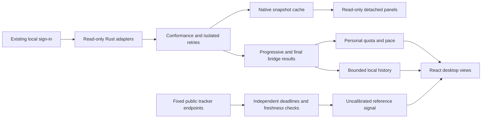

# Quota Float Architecture

## System boundary

Quota Float is a local-first Tauri desktop application. React renders the widget and owns presentation state; Rust owns provider credential access, persistence, native window geometry, tray behavior, notifications, and update integration. Browser development uses synthetic snapshots and never reads a real provider session.

## Runtime layers

| Layer | Primary files | Responsibility |
| --- | --- | --- |
| Presentation | `src/App.tsx`, `src/components/*`, `src/styles.css` | Distinct compact/expanded layouts, full-catalog provider selection, alerts, status center, accessibility, responsive themes |
| Frontend domain | `src/lib/*` | Preference/runtime normalization, quota pace, forecast planning safeguards, reset detection, history, update state, last-known-good merging |
| Desktop bridge | `src/lib/bridge.ts` | Typed Tauri commands/events, serialized writes, drag stability detection, browser mocks |
| Native orchestration | `src-tauri/src/lib.rs`, `src-tauri/src/models.rs`, `src-tauri/src/codex_usage.rs` | Commands, window state, physical-pixel geometry, bounded local Token aggregation, tray, lifecycle |
| Native storage | `src-tauri/src/storage.rs` | Bounded reads, validated compact runtime/backup writes, recovery, and provider-scoped detached-panel history |
| Provider registry | `src-tauri/src/provider_registry.rs` | Stable ordering, selected-provider collection, adapter timeouts, bounded transient retries, and the shared outbound snapshot conformance boundary |
| Provider adapters | `src-tauri/src/{codex,claude,qoder,trae,workbuddy,volcengine,antigravity}.rs` | Read-only discovery, request/parsing, provider-specific error isolation |
| Public reset outlook | `src-tauri/src/reset_forecast.rs`, `src/lib/quotaPace.ts`, `src-tauri/capabilities/default.json` | Fixed-origin public forecast collection, freshness/schema validation, robust consensus, timed-announcement handling, conservative planning integration, and source-link allowlisting |

## Repository structure

| Path | Ownership and contents |
| --- | --- |
| `src/components/` | React surfaces and interaction boundaries: compact/expanded quota cards, full provider switcher, Control Center tabs, Insights, diagnostics, and update UI |
| `src/lib/` | Browser-safe domain logic, typed bridge calls, refresh/pace policy, history, preferences, pricing, exports, and synthetic preview data |
| `src-tauri/src/` | Native-only credential access, provider adapters, public reset aggregation, persistence, geometry, notifications, tray, updater, and sanitized Codex indexing |
| `src-tauri/capabilities/` and `src-tauri/gen/schemas/` | Auditable Tauri permission source plus generated capability schema; capability changes must keep these synchronized |
| `scripts/` | Version/release helpers, bundle budgets, compatibility checks, Windows Defender verification, and release automation tests |
| `.github/workflows/` | CI, provider compatibility, security, release/publish, signing, and upgrade-smoke orchestration |
| `docs/` | Desktop SOP, architecture, project baseline/history, test matrix, distribution guidance, and immutable per-version release evidence |
| `assets/` and `docs/images/` | Application icons and user-facing documentation screenshots |

## Data flow



The public-signal path has no connection to personal pace calculation. Credentials terminate within the native adapter boundary and are not present in either bridge payloads or public requests.

1. React computes which unpaused providers are due from independent attempt clocks, health state, and the selected resource mode, then requests only that subset through `bridge.ts`.
2. A Tauri command asks the provider registry to refresh the selected isolated Rust adapters concurrently under a shared refresh lock and bounded cache. Transiently failed network/file adapters receive bounded same-cycle retries; Qoder, Volcengine and Antigravity do not, because blocking work or external probes may outlive a timeout. Qoder's read-only SQLite/decryption work runs on a blocking worker with bounded input size and lock wait.
3. The provider registry normalizes every outbound `ProviderSnapshot`: descriptor-owned identity, allowlisted status, finite/clamped quota values, bounded text/list payloads, parseable timestamps, empty failure payloads and redacted diagnostics. Rust returns only those conformed values without exposing credentials or raw provider payloads.
4. Each provider emits one conformed completion after its own bounded retries; the native cache is updated before a widget-only event. The bridge subscribes before invoking and validates request IDs, target sets and duplicate results. React merges progressive results for immediate display. Only the final command result derives reset/notification/history effects from the pre-refresh baseline, preventing duplicate effects; final results retain registry ordering. Bounded runtime history is persisted only when the persistable state changes. The latest 90 days retain full quota samples; older days retain their first, last, minimum, and maximum points through daily compaction. Daily usage summaries and coverage metadata remain local for the lifetime of the installation, subject to explicit safety caps.
5. Rendering selects Float, Ring, Bar, or Bottleneck for compact mode and one of four expanded layouts.

Balanced mode refreshes healthy providers on a five-minute cadence, fast-reset or critical providers every minute, and unavailable providers with a thirty-minute cooldown. Project Focus mode stretches those intervals to fifteen, five, and sixty minutes, disables provider auto-rotation and ambient infinite animation, while manual refresh remains available.

Refresh requests remain single-flight. A manual forced refresh arriving during an automatic refresh queues one follow-up forced pass instead of being swallowed by the automatic pass. Repeated manual requests share that queued pass; an active forced pass remains shareable. Last-known-good merging includes snapshots whose only available metric is a reset-credit balance.

The Insights tab lazily requests a separate Codex Token report covering every retained local session metadata file. Rust streams those files under explicit file, byte, line, and index-size safety caps, ignores message content, and persists a sanitized, versioned per-file cursor index in the application config directory. Index entries use full SHA-256 file identities rather than relative paths or raw filenames. Unchanged files reuse indexed aggregates; append-only files resume from the saved byte cursor; truncation, metadata changes, or a manual rebuild reparses the affected scope. If a safety cap is reached, the report is explicitly marked partial. The UI receives only hourly numeric aggregates grouped by model, context tier, project basename, normalized terminal category, and a one-way hashed session key.

Project identity uses a domain-separated SHA-256 digest of a lexically normalized path inside Rust; only an opaque ID and bounded basename label leave that boundary. Index schema 4 rebuilds older indexes from retained sources rather than guessing identity. Project filters and export aliases use the ID, so equal basenames remain distinct. Raw paths are neither stored in the index nor sent to the WebView.

React applies range and dimension filters, derives session/activity/cache metrics, and evaluates each model against the versioned standard-API price catalog in `src/lib/openaiPricing.ts`. It builds comparisons, charts, per-model cost rows, and a local monthly budget outlook. On-demand reports cover the current local week (Monday start) or month through now, applying active dimension filters. Unrecorded hours do not establish missing data or zero usage; only an explicit scan truncation is known incomplete. JSON records filter-scope booleans without filter values. CSV/JSON exports aggregate away session keys and alias projects, excluding opaque project IDs; the SVG share card exports summary metrics only. Native export writes only an explicitly selected `.csv`, `.json`, or `.svg` target.

Provider failures are partial: one unavailable adapter must not erase healthy providers. A transient failure retains the last valid value with a stale status; signed-out and malformed responses receive explicit non-secret errors. Unknown statuses and `ok` snapshots without measurable quota fail closed to `unavailable` before crossing the desktop bridge.

## Public Codex reset outlook flow

The global reset outlook is informational and remains separate from the personal quota reset time reported by Codex:

1. When Codex is included in a refresh, `App.tsx` requests quota snapshots and the public reset outlook in parallel.
2. `reset_forecast.rs` concurrently reads three fixed unauthenticated JSON endpoints—Codex Reset, Codex Reset Radar, and Will Codex Reset Today—under a five-second overall boundary. Each response is capped at 128 KiB; the shared native HTTP client disables redirects and sends no provider credential, account identifier, quota value, or local Token count.
3. Each source must expose a 48-hour forecast and a timestamp no older than six hours. Accepted scores are aggregated as a median; source-specific timeouts preserve successful peers. The aggregate freshness must not hide the oldest participating observation.
4. Source count and individual scores expose third-party inputs, not calibrated predictive confidence. Shared underlying data can make trackers correlated; the native result conservatively retains low confidence for these public signals even when scores agree. A tracker reporting an announcement does not verify an official or account-specific reset and cannot set an actionable announcement or expected reset timestamp.
5. React exposes source information separately from the personal reset. Personal pace always uses the provider-reported `resetsAt`, including when previously persisted baselines contain an earlier speculative horizon. Public probabilities and reported announcements never increase the daily quota budget.

Failure is fail-closed: stale, malformed, oversized, redirected, timed-out, or unexpected-window responses are discarded independently. If no valid source remains, no public outlook is shown and provider quota collection continues unaffected.

### Accuracy and observability boundaries

There are three distinct pieces of evidence: a provider-reported future cycle boundary, a local observation of quota recovery/cycle transition, and an unauthenticated public prediction. None should silently overwrite another. Compact timestamp dates use the same local timezone as detailed reset timestamps; explicit calendar-only dates retain their calendar meaning.

Predictive accuracy is not established by unit tests or source agreement. A future calibration study needs timestamped predictions frozen before the outcome, a defined global-reset event label, time-separated evaluation, source availability/coverage, and proper probability metrics such as Brier score and reliability bins. Personal credit redemption and rolling quota recovery must not be mislabeled as global reset events. No additional private account collection or background telemetry is introduced by this review.

Review ownership, root causes, verification evidence, and archived specialist-task references are recorded in [REVIEW-2026-09-09.md](REVIEW-2026-09-09.md).

## Preferences and recovery

`WidgetPreferences` is normalized independently in TypeScript and Rust. Missing fields receive safe defaults, provider order is deduplicated/completed, numeric values are bounded, and unknown enum values fall back to supported values. Resource mode and paused-provider IDs use the same cross-language normalization; at least one provider remains monitored.

Bar placement is stored as:

```ts
type BarEdge = "top" | "left" | "right";
type BarPlacement = { edge: BarEdge; offset: number };
```

Legacy preferences and saved layouts migrate to `{ edge: "top", offset: 0.5 }`. The same fields flow through layout profiles, export/import, and automatic recovery backups. Before state is applied, the backup envelope must be a plain object with plain settings/history sections; malformed arrays and unsupported future schema versions are rejected, while schema-less legacy backups map to schema 1. Runtime history schema 1 migrates to schema 2 by deriving local-memory coverage metadata from existing samples. Credential material is never part of those files.

## Window geometry

Window geometry is calculated in Rust physical pixels from the active monitor and the current usable work area:

- Float/Ring visual size: `92×92` logical pixels.
- Top Bar: `400×38` logical pixels.
- Left/Right Bar: `64×320` logical pixels.
- Transparent safe inset: 4 logical pixels around the visual surface.
- Magnetic zone: 24 logical pixels from Top, Left, or Right; Bottom is unsupported.

The Bar stores a normalized along-edge offset rather than an absolute position. Collapse recomputes the attached position for the current work area. Expansion uses the same edge/offset with the larger dashboard size, opens inward, and clamps to the work area. Content-driven height changes recalculate from that anchor. Dragging an expanded dashboard records only temporary expanded movement and does not alter Bar placement.

The bridge waits for native drag position stability, asks Rust to resolve the edge and offset, then returns the placement to React for persistence through the normal preference-write queue.

Pointer entry requests native expansion only while React is compact. Native resize/reposition can itself generate pointer entry; repeating `expand_widget` for an already expanded card would reset the measured height to the 260px baseline. Pinned-open compact-layout/placement changes explicitly resynchronize the visible card after native expansion. Content measurements use `offsetHeight`, so entrance transforms cannot distort the requested logical height. Native tests verify the viewport remains large enough during pointer re-entry, in addition to eventually reaching its expected bounds.

## Security invariants

- Provider credential access remains inside `src-tauri`.
- Credentials go only to the corresponding official provider endpoint or a documented loopback-only local service.
- Provider credentials, account identifiers, auth paths, prompts, chats, raw session records, and raw provider responses are neither persisted nor included in diagnostics. Only the documented sanitized Token cursor/index is persisted locally.
- Provider snapshot diagnostics are bounded and reject raw JSON, credential markers and user-directory paths at the shared registry boundary.
- Clipboard diagnostic exports are constructed from an explicit allowlist of operational fields. They exclude configuration directories and free-form event titles/details; native diagnostic objects are not serialized wholesale.
- Provider reads are non-mutating: no reset redemption, account updates, or provider configuration writes.
- Public reset-outlook requests are unauthenticated reads to three fixed HTTPS origins and never receive provider credentials, account data, quota values, or local Token counts.
- Import/export file selection is native-owned; the webview never supplies arbitrary filesystem paths.
- Browser preview and tests use synthetic or fixture data.

See `PRIVACY.md`, `SECURITY.md`, and `docs/DESKTOP-DEVELOPMENT-SOP.md` for the complete operational boundary.

## Verification architecture

- TypeScript pure-function tests cover migration, clamping, pace, reset/history behavior, price calculation, filtering, budget forecasting, and anonymized exports.
- Component tests cover compact/expanded layout differentiation, themes, the seven-provider pointer/keyboard switcher, Control Center tabs, Insights behavior, accessibility, hover timing and saved layouts.
- Bridge tests cover command payloads, serialized writes and drag-result persistence.
- Rust tests cover provider parsing, the shared adapter conformance contract, preference normalization, bounded/incremental Token indexing, multi-monitor/DPI/work-area geometry, and a deterministic taskbar/display-removal lifecycle fixture.
- Reset-outlook tests cover live response shapes, freshness and window rejection, robust median consensus, confidence, and timed-announcement priority; TypeScript tests cover conservative planning fallbacks.
- A scheduled Windows/macOS compatibility workflow runs every provider's synthetic fixtures without credentials.
- Native WebDriver smoke tests launch the compiled Windows application and exercise the Tauri bridge and primary overlays.
- Production builds enforce JavaScript/CSS size budgets after lazy-loading secondary panels.
- The desktop fast handoff gate adds production build, Rust formatting, `check`, strict `clippy`, and diff validation.
- Real Windows/macOS smoke tests remain necessary for WebView transparency, native dragging, always-on-top, pointer pass-through and tray/menu behavior.
