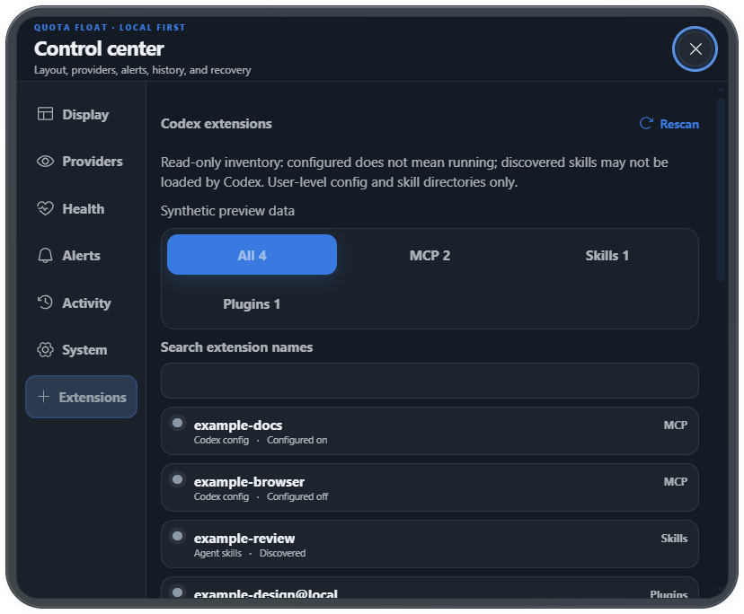

# Quota Float v0.3.15 更新归档

应用提交：`48ad315f7c10e2b2d31d21c285f3333275225063`。

发布提交：`f05e8697c390f36bba9f37ccad5ef5bfcb6fd43a`；annotated tag 对象 `8bb897c679f47311441f7b99d4c76014b4daf75b`，解引用到该发布提交。它由本次 GitHub Actions 创建，仅机械更新六个版本/Changelog 文件。本地已通过 ff-only 同步，并核对本地 HEAD、origin/main、实时 GitHub main 和解引用 tag 一致；公开 Release target 与下载产物在发布后另行核验。

## 功能与研究

控制中心新增 Codex MCP、Skills、插件配置只读清单与六个开源伴侣入口，支持类型/名称筛选、手动扫描、部分来源提示和刷新失败保留。配置启用、停用与目录发现分开显示，不宣称插件已安装或正在运行。没有安装/执行第三方代码，没有修改 Codex 配置或 provider 凭据。

- [实现与范围](EXTENSIONS-2026-09-15.md)
- [高星伴侣研究及官方源链接](research/codex-companions-2026-09-15.md)
- [应用源提交](https://github.com/silverlion2/quota-float/commit/48ad315f7c10e2b2d31d21c285f3333275225063)
- [源码 CI](https://github.com/silverlion2/quota-float/actions/runs/34871586824)
- [发布流程](https://github.com/silverlion2/quota-float/actions/runs/34871696477)

三个 `gpt-5.6-luna` 子代理分别完成研究、原生扫描器和独立审查；主代理负责取舍、界面、集成、补充边界测试与发布。审查及验证中修正了可选目录缺失、源目录链接、读取错误导致清单不完整、Unicode 名称、异常配置值和 `not_found` 序列化契约问题。

## 已完成的本地验证

- 318 项前端测试 / 40 文件，通过。
- 102 项 Windows Rust 测试，通过；最终迭代器清理后，7 项扩展专项再次通过。
- 生产构建、fmt、cargo check、全部 targets 的严格 Clippy、版本和 diff 检查通过。
- 生产入口 JS 216,410 B，总 JS 569,684 B，gzip JS 177,772 B，CSS 151,559 B；原有体积门槛未调整。开发设计预览不再进入生产包。
- 10/10 Windows 原生 E2E 通过，包括扩展命令的合成数据隔离、界面/仓库入口、搜索和窗口边界。已有独立 tauri-driver 缺失提示及 mock-store 清理警告未影响 embedded driver 测试结果，退出码为 0。

## 发布与签名

已公开为 Stable、非草稿：[v0.3.15](https://github.com/silverlion2/quota-float/releases/tag/v0.3.15)。源码 CI 与发布流程均 `success`；verify、create-release-ref、两平台 publish-draft、upgrade-smoke、finalize、post-release-distribution 全部成功。Windows 实际 executable/installer 的 Defender 扫描通过。

Linux 发布验证为 91 项 Rust 测试通过；前端 39 个文件通过、1 个 Windows PowerShell 专属文件跳过，该文件已在本地 Windows 的 318 项完整前端套件中通过。操作系统专属签名步骤的跳过/早退出不当作已配置系统签名。

草稿 Windows 安装包 asset ID **563835483**，SHA-256 **142e230f89ba9999527f9ea765708b708488500aa22536bb085b8d8a45ac7455**：从 v0.3.14 安装升级到 v0.3.15，并通过启动、回滚、重装、卸载；公开前后复核为同一 asset/digest。

下载全部六项公开资产后，逐项 SHA-256 与 GitHub Release API 一致；latest.json 的版本、平台 URL、签名文本全部对应该公开 Release。Windows installer 和 macOS updater archive 用应用内公钥通过 minisign 验证，分别篡改内存副本首字节后均被拒绝。

公开产物独立验收时，Release target、当时的本地 HEAD、origin/main 和 v0.3.15 解引用 tag 全部精确等于 **f05e8697c390f36bba9f37ccad5ef5bfcb6fd43a**。两个 publish-draft checkout 的日志也记录该 commit。应用源码提交与 release commit 仅相差六个版本/Changelog 文件。GitHub 发布说明已补充具体功能与验收范围。

| 公开资产 | SHA-256 |
| --- | --- |
| latest.json | b18fd73e3c6d600cb57cd060ea7dddfb8ceb734f2425fd568a202b94e8da5e73 |
| Quota.Float_0.3.15_universal.dmg | 919869645700cdcd0c25bc123c7227b5b180b248ce2df645413ebb8cbbb075f7 |
| Quota.Float_0.3.15_x64-setup.exe | 142e230f89ba9999527f9ea765708b708488500aa22536bb085b8d8a45ac7455 |
| Quota.Float_0.3.15_x64-setup.exe.sig | 87aac2c84d7defd054e65cf7d4ee12bdc01526106b81699b0a140ee58b3b3fc8 |
| Quota.Float_universal.app.tar.gz | 48d12cf2440236ed7c81e956b32e19ca1daf1eff74d678d2560a0ed4f0c82d93 |
| Quota.Float_universal.app.tar.gz.sig | d981f31686e11e7edaf22cb5c9b4c65a8a7f1c605848a049db21c3e0013b1c79 |

Windows Authenticode、macOS Developer ID 和 notarization 均未配置；Tauri 更新完整性签名已独立验证。工作流的 github-script@v7 仍提示 Node 20 action runtime 废弃并由 GitHub 强制使用 Node 24，本次所有流程成功；此提示不等同于任务失败。

## 平台范围

Windows 多显示器、全部物理 DPI 组合以及真实 Mac 运行/视觉验收仍未完成；Windows 合成原生测试与 macOS Universal 构建不能替代对应硬件验收。此次不改变平台证书配置；Tauri updater 完整性签名与系统信任签名分别核验和记录。

本记录按用户要求在正式发布后提交到项目；main 因而包含一个额外的纯文档归档提交。v0.3.15 标签、Release target 和公开产物继续固定在 f05e8697c390f36bba9f37ccad5ef5bfcb6fd43a，不移动标签、不重建或替换产物。最终文档提交 hash 在任务交接中报告；下载文件、API快照与独立验证脚本保留在 output/review-2026-09-15。

