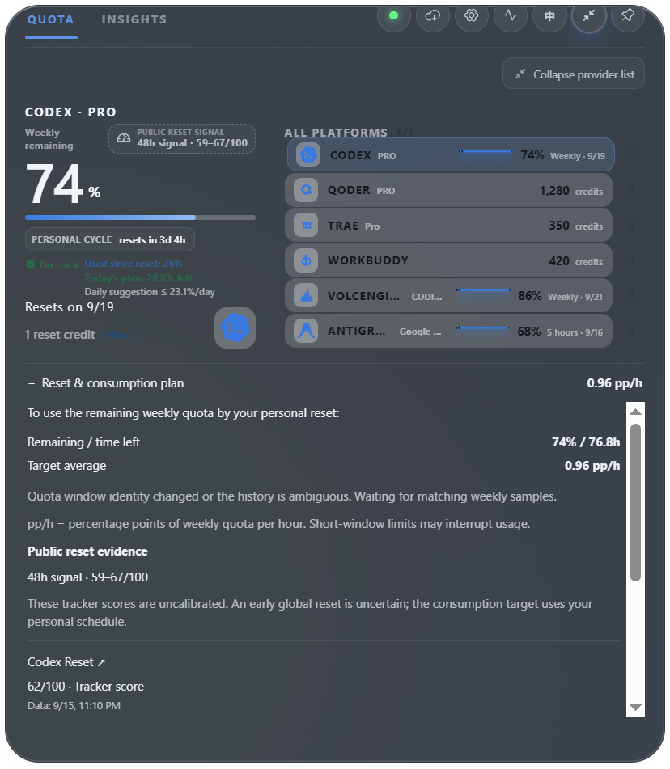

# Reset prediction and consumption planning — 2026-09-15

## Outcome

The public reset outlook now checks the reset history behind a fresh tracker response. It exposes conflicting or missing evidence instead of presenting the median as a reliable forecast. A separate consumption plan calculates the weekly percentage points per hour needed to use the remaining quota by the provider-reported personal reset, and compares it with recent local quota consumption when sufficient continuous history exists.

## Observed failure

The public responses inspected on September 15 disagreed materially:

- [Codex Reset](https://codex-reset.com/api/forecast) reported a September 12 reset and a 48-hour score of 42. Its published backtest status was experimental and did not beat both of its comparison baselines.
- [Will Codex Reset Today](https://codexreset.app/api/signal) returned a fresh data timestamp and a 48-hour score of 91, while its last confirmed reset was still July 25.
- The Radar endpoint failed the first local probe; the independent audit later retrieved a score of 45 with an August 31 reset baseline. A source failure must remain isolated.

The previous parser checked only response age and then took the median. A freshly generated page can still rely on obsolete reset history. None of these third-party records independently verifies an official future reset.

## Changes and limits

- Compare reported reset baselines; only exclude an older baseline when at least two distinct tracker origins agree on a newer date within 24 hours. A lone newer claim does not automatically become truth.
- Missing baseline, unresolved reset-date conflict, and materially disagreeing scores remain visible as evidence limitations. Source agreement is not calibrated probability.
- Expose individual scores, data timestamps, reported last resets, inclusion state and exclusions. Conflicting/limited evidence has no headline numeric estimate.
- The personal consumption target is remaining weekly percentage divided by hours until the provider reset. It does not change daily pace baselines or assume an early global reset.
- The local burn estimate uses a bounded six-hour lookback, at least three distinct samples spanning 30 minutes, fresh current quota, matching weekly reset identity, and a continuous segment. Refills, invalid/stale points, reset changes and long gaps split the segment. Idle time is included. Predictions assume the observed average continues; short-window limits can interrupt usage.
- Provider credentials and requests remain read-only inside Rust. Frontend/native E2E preview uses synthetic data. No new dependencies, telemetry or external account mutations.

No historical ground-truth evaluation of Quota Float's new policy has been completed. This change fixes demonstrable input-quality and presentation errors; it does not claim a measured percentage improvement in reset prediction accuracy.

## Rollback and validation

This is an additive, non-persistent presentation/calculation change. Existing preferences and quota history remain compatible with v0.3.15; rollback uses the previous public installer. Full local gate results and the exact release workflow/artifact checks are recorded with the v0.3.16 release evidence after they finish.

Local validation: 334 frontend tests passed across 43 files; after the clock-refresh correction, 58 affected component tests passed again. Windows Rust full suite passed 108 tests, followed by 14 reset-forecast tests after the additional parser/future-time regression (109 total tests now defined). Production build/bundle budgets, formatting, cargo check, strict Clippy and version/diff checks passed during integration; final build checks are repeated before committing.

11 native Windows E2E tests passed, including the new expandable consumption plan, bounded scrolling, source details, existing settings, detached windows and update dialog. The existing missing standalone tauri-driver diagnostic and mock-store cleanup warning did not prevent the embedded driver run; exit status was zero. Hardware DPI/multi-monitor coverage and real Mac UI checks remain outside this automated evidence.

Two bounded `gpt-5.6-luna` subagents handled the Rust source-quality logic and local consumption helper/review. The main agent reviewed the integration, added parser and presentation tests, fixed the minute-clock refresh edge case, ran the desktop gates and owns publication.

